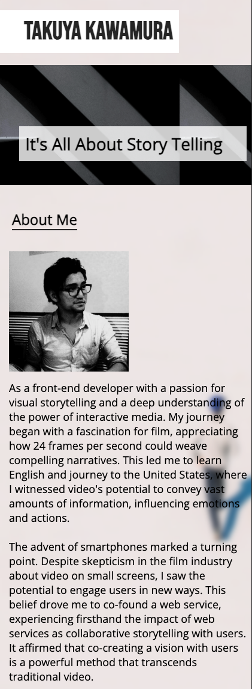
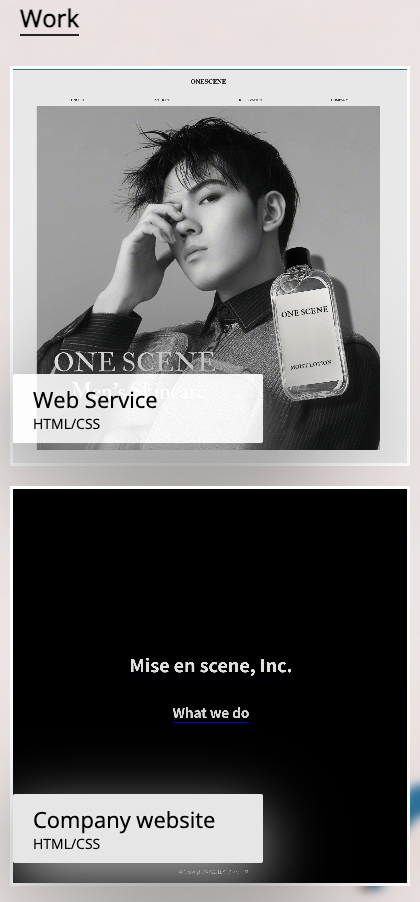
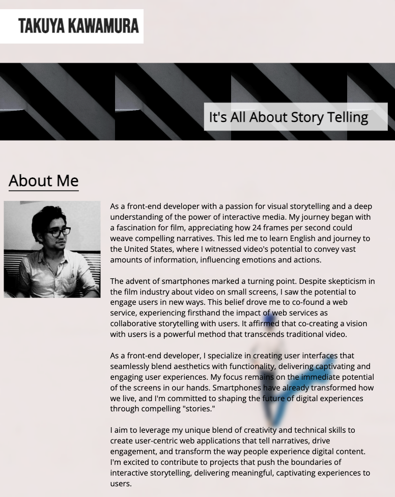
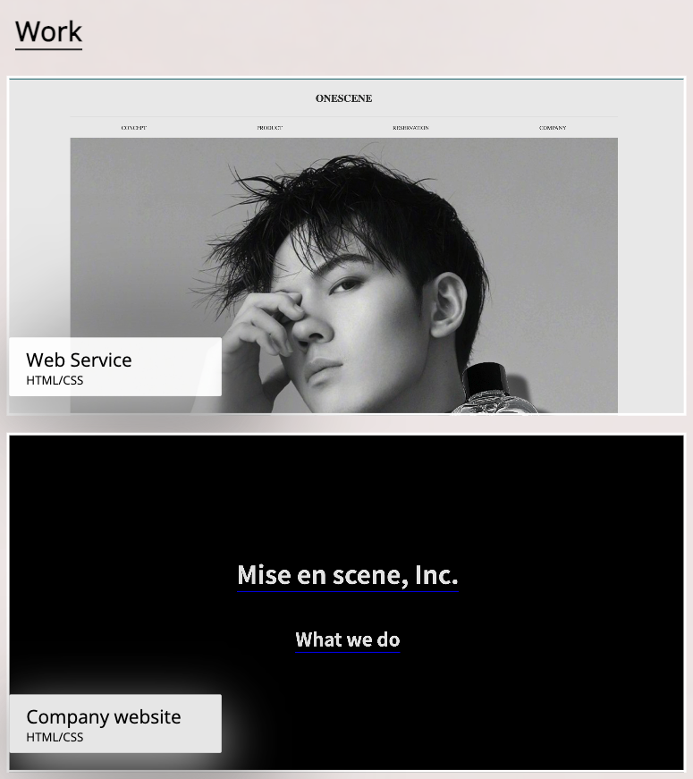
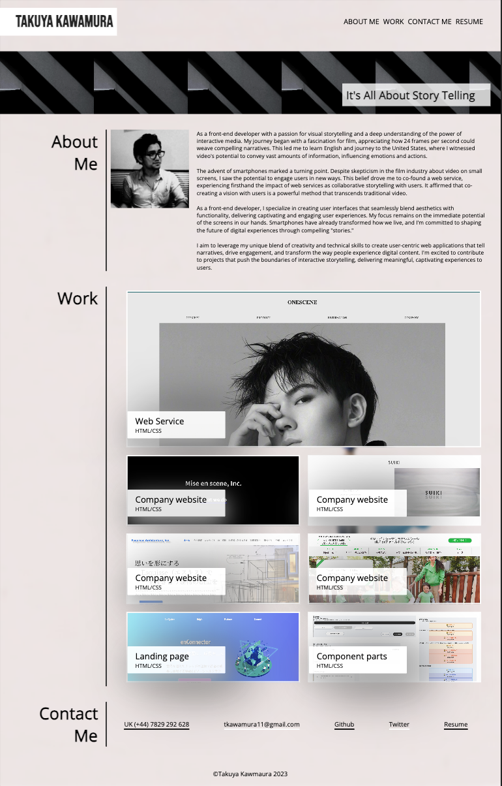

# Refactoring the marketing website

<!-- ABOUT THE PROJECT -->

<!-- TABLE OF CONTENTS -->

  
Table of Contents

  <ol>
    <li>
      <a href="#about-this-project">About this Project</a>
      <ul>
        <li><a href="#built-with">Built With</a></li>
      </ul>
    </li>
    <li><a href="#roadmap">Roadmap</a></li>
    <li><a href="#important-note">Important Note</a></li>
    <li><a href="#website-preview">Website Preview</a></li>
    <li><a href="#credits">Credits</a></li>
    <li><a href="#license">License</a></li>
    <li><a href="#contact">Contact</a></li>
  </ol>

## About this project

This Takuya Kawamura's portfolio for the bootcamp and general public. This portfolio includes various CSS techniques such as media queries, flex-box, grid, and variable. The criteria is listed below in the roadmap. This website will be responsive for mobile, tablet and desktop.

### Built With

- ![HTML]
- ![CSS]

## Roadmap

- [x] When the page is loaded the page presents your name, a recent photo or avatar, and links to sections about you, your work, and how to contact you
- [x] When one of the links in the navigation is clicked then the UI scrolls to the corresponding section
- [x] When viewing the section about your work then the section contains titled images of your applications
- [x] When presented with the your first application then that application's image should be larger in size than the others
- [x] When images of the applications are clicked then the user is taken to that deployed application
- [x] When the page is resized or viewed on various screens and devices then the layout is responsive and adapts to my viewport

## Important note

This is the Takuya's portfolio mock-up for the bootcamp project. The design is provided. Some of the works are just an illustration and links will take you to a random website.

### Website Preview

For mobile with max-width of 420 px

  
  

For tablet with max-width of 820 px

  
  

For desktop with max-width of 1280 px

  

You can find the github preview page below
[github preview page](https://sebecjeanluc.github.io/TakuyaKawamura_portfolio/)

### Credits

This is a mock-up website for the bootcamp. The images and its codes are not copyrigt free.

### Third-party service

[Google fonts](https://fonts.google.com/)

### License

Distributed under the MIT License. See `LICENSE.txt` for more information.

## Contact

Tak Kawamura - [@\_takuyakawamura](https://twitter.com/_takuyakawamura) - tkawamura11@gmail.com

<!-- MARKDOWN LINKS & IMAGES -->
<!-- https://www.markdownguide.org/basic-syntax/#reference-style-links -->

[HTML]: https://img.shields.io/badge/HTML-orange
[CSS]: https://img.shields.io/badge/CSS-blue
